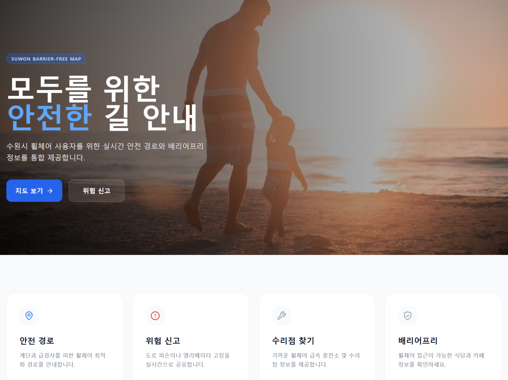
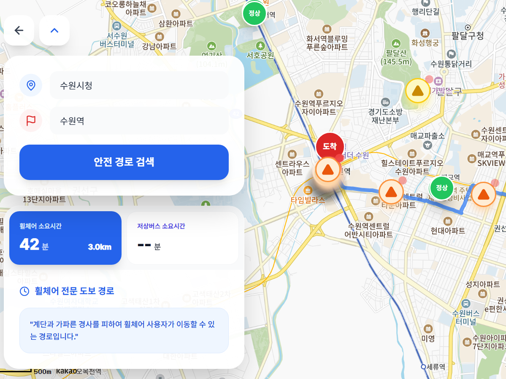

<div align="center">

# 모두의 길 (Modu-Gil)

**수원시 교통약자를 위한 배리어프리 내비게이션 플랫폼**

계단·급경사를 회피하는 휠체어 최적 경로 안내와 실시간 위험 제보 시스템을 통합 제공합니다.

[](https://frontflask.netlify.app)
[](https://frontflask.netlify.app)
[](https://cloudtype.io)
[](https://supabase.com)
[](https://github.com/yoosehyeon/3Team_FlaskPJ)

</div>

---

## 서비스 화면

| 홈페이지 | 경로 탐색 결과 |
|:---:|:---:|
|  |  |
| 안전 경로·위험 신고·편의시설 검색 기능 제공 | 출발지~목적지 간 계단·급경사 회피 경로 및 위험 구간 마커 표시 |

---

## 핵심 기능

| 기능 | 설명 |
|------|------|
| **지능형 경로 탐색** | Tmap API `facilityType` 분석으로 계단(Code 11)·급경사 구간 필터링 후 휠체어 최적 경로 제공 |
| **위험 구간 시각화** | 지도 위 실시간 마커로 위험(빨강)·주의(주황)·정상(초록) 구간 표시 |
| **실시간 위험 신고** | 사용자 직접 장애물 사진 업로드 및 위치 제보 (Supabase Storage) |
| **반경 내 시설 검색** | PostGIS `ST_DWithin` 기반 300m 이내 휠체어 편의시설 초고속 조회 |
| **대중교통 연동** | ODsay API 활용, 저상버스·지하철 엘리베이터 동선 포함 최적 경로 안내 |
| **접근성 최적화** | WCAG 2.2 준수 (클릭 요소 44×44px, 애니메이션 감소 모드 지원) |

---

## 기술 스택

### Frontend


### Backend


### Infrastructure & DB
-3ECF8E?style=flat-square&logo=supabase&logoColor=white)


---

## 프로젝트 구조

```
3Team_FlaskPJ/
├── backend/                  # Flask API 서버
│   ├── routes/
│   │   ├── route.py          # Tmap facilityType 필터링 미들웨어
│   │   └── places.py         # PostGIS ST_DWithin 반경 조회
│   ├── db.py                 # Supabase NullPool 커넥션 설정
│   └── app.py                # Gunicorn 앱 진입점
├── frontend/                 # React (Vite) 앱
│   ├── src/hooks/            # TanStack Query 커스텀 훅
│   └── src/store/            # Zustand 전역 상태 관리
└── supabase/                 # PostGIS DDL 및 RLS 정책
```

---

## 핵심 기술 구현

### Tmap API 장애물 필터링

일반 보행자 경로 API는 계단·턱을 **지름길**로 안내하여 휠체어 사용자에게 위험을 초래합니다. 이를 해결하기 위해 `facilityType` 기반 Feature 분석 미들웨어를 구축했습니다.

| facilityType 코드 | 의미 | 처리 방식 |
|:---:|------|------|
| `11` | 계단 | 즉시 위험 경고 활성화 → 경로 재탐색 |
| `17` | 엘리베이터 | 휠체어 권장 구간으로 분류 |

```python
# backend/routes/route.py
# Tmap API FeatureCollection 순회 → facilityType으로 장애물 감지
has_obstacle = False
for feature in features:
    properties = feature.get('properties', {})
    facility_type = properties.get('facilityType')

    if facility_type in ["11", 11]:  # Code 11: 계단
        has_obstacle = True
        break
```

---

## 트러블슈팅

### Serverless 환경의 Body 파편화 & DB 커넥션 고갈 문제

**상황**  
배포 후 로그인·위험 제보 POST 요청 시 데이터가 파손되어 전달되거나, DB 커넥션 고갈로 서버가 다운되는 현상이 반복 발생.

**원인 분석**  
- Netlify Functions 특성상 대형 페이로드가 **바이트 인덱스 객체로 파편화**됨을 확인
- PgBouncer 환경에서 일반 커넥션 풀을 사용해 **커넥션 고갈** 발생

**해결책**

```python
# 1. Body Recovery 미들웨어 — 파편화된 JSON을 서버 진입점에서 복구
@app.before_request
def recover_body():
    if request.content_type == 'application/json':
        raw = request.get_data(as_text=True)
        # 파편화된 바이트 인덱스 객체 → 정상 JSON 복구 로직

# 2. NullPool 전략 — PgBouncer 환경에 맞게 커넥션 고갈 방지
from sqlalchemy.pool import NullPool
engine = create_engine(DATABASE_URL, poolclass=NullPool)
```

**결과**  
빌드 2회 만에 서비스 정상화. 이후 동일 오류 재발 없음.

---

## 로컬 실행 방법

### 사전 요구사항
- Node.js 18+
- Python 3.11+
- Supabase 프로젝트 및 API Key

### 1. 저장소 클론

```bash
git clone https://github.com/yoosehyeon/3Team_FlaskPJ.git
cd 3Team_FlaskPJ
```

### 2. 백엔드 실행

```bash
cd backend
pip install -r requirements.txt

# 환경변수 설정
cp .env.example .env
# .env에 SUPABASE_URL, SUPABASE_KEY, TMAP_API_KEY 입력

python app.py
```

### 3. 프론트엔드 실행

```bash
cd frontend
npm install

# 환경변수 설정
cp .env.example .env.local
# .env.local에 VITE_API_BASE_URL 입력

npm run dev
```

---

## 향후 고도화 계획

- [ ] **경사도 데이터 연동** — 공공데이터 포털 API 결합, 급경사 구간 자동 회피 로직
- [ ] **접근성 가중치 알고리즘** — 최단 거리 대신 엘리베이터(Code 17) 우선 '최적 접근성 경로' 안내
- [ ] **수원시 외 지역 확장** — 전국 단위 배리어프리 데이터 연동

---

## 팀원

| 역할 | 담당자 | 핵심 책임 | 주요 기술 |
|------|--------|----------|-----------|
| PM / 인프라 | 유세현 | 아키텍처, CI/CD, 공통 모듈 | Flask, SQLAlchemy, GitHub Actions |
| 공간 데이터 | 이승연 | 휠체어 안전 경로 알고리즘 | Kakao Maps SDK, Tmap, Turf.js |
| 엘리베이터 추적 | 권우영 | 공공 API 연동, 데이터 정규화 | Flask, requests, 공공데이터 포털 |
| 교통 데이터 | 이동규 | 저상버스 필터링, 응답 최적화 | ODsay API, Zod, TanStack Query |
| 콘텐츠 관리 | 변호준 | 배리어프리 업소 50개, 반경 검색 | PostGIS, Supabase, SQL |
| PL / 실시간 | 김성익 | 신고 시스템, 이미지 업로드 | Flask, Supabase Realtime, Storage |

---

<div align="center">

© 2026 Modu-Gil Team · 수원시 휠체어 통합 내비게이션

</div>
